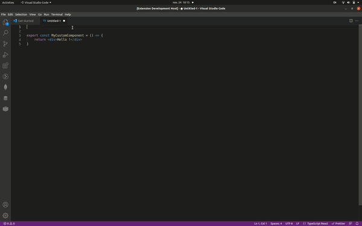

# Standard-jit (Just-In-Time)

Display Theodo technical standards directly in your IDE !

## Installation

- On the [release page](https://github.com/theodo/standard-jit/releases), download latest release .vsix file
- run `code --install-extension standard-jit-[release-tag].vsix`. Be sure to launch this command in the directory you downloaded the release and to change `release-tag` with the release you chose !

You may need to reload VSCode for the extension to start.

To check if the extension works correctly, try to type for example `lodash`, you should see a code lens displayed above the line.

You are all set !

If you want to temporarly enable/disable the extension:

- View > Command Palette > Standard JIT: Enable/Disable

---

## Extension Settings

This extension contributes the following settings:

- `standard-jit.enableCodeLens`: enable/disable this extension
- `standard-jit.standardsToInclude`	Select which standards to show. Please note that you will need the appropriate Notion accesses. Default value is `[theodo]`

## Using the extension

Commands (via View > Command Palette):

- `Standard JIT: Enable`: activate extension
- `Standard JIT: Deactivate`: deactivate extension
- `Standard JIT: Unhide standards`: show again all standards previously hidden

## Standard mapping

To see which standards are currently linked with which keyword, see this [github repo](https://github.com/theodo/standard-jit-db).

For example, to check the `theodo` mapping, go to the appropriate [folder](https://github.com/theodo/standard-jit-db/blob/master/src/theodo/standardMapping.json)

---

**Enjoy!**
